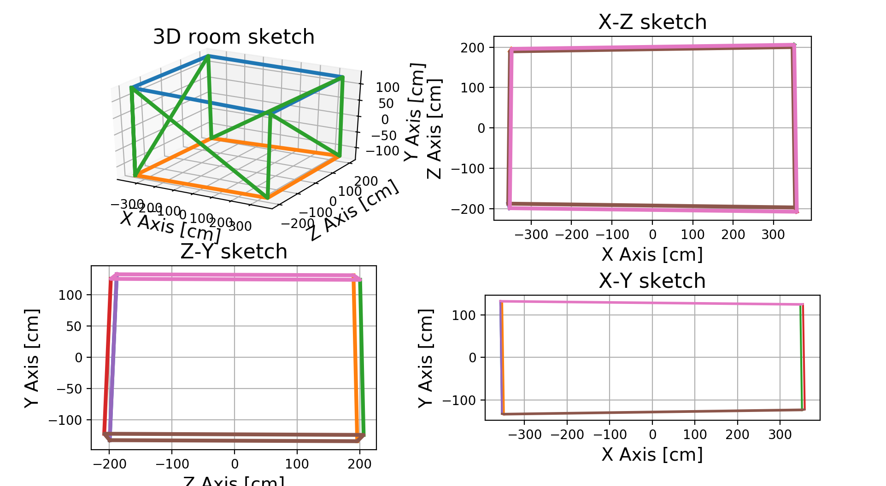
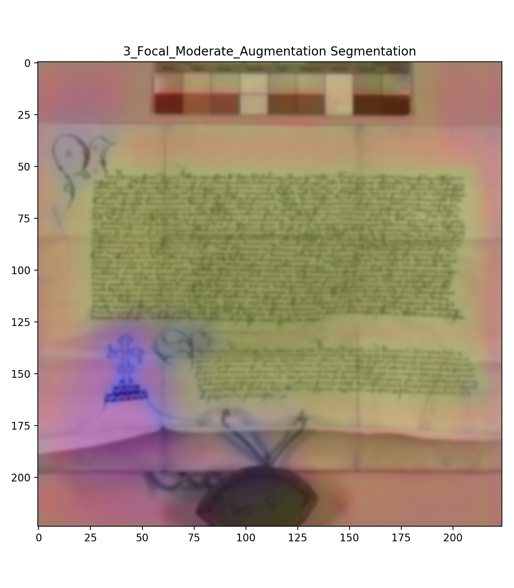
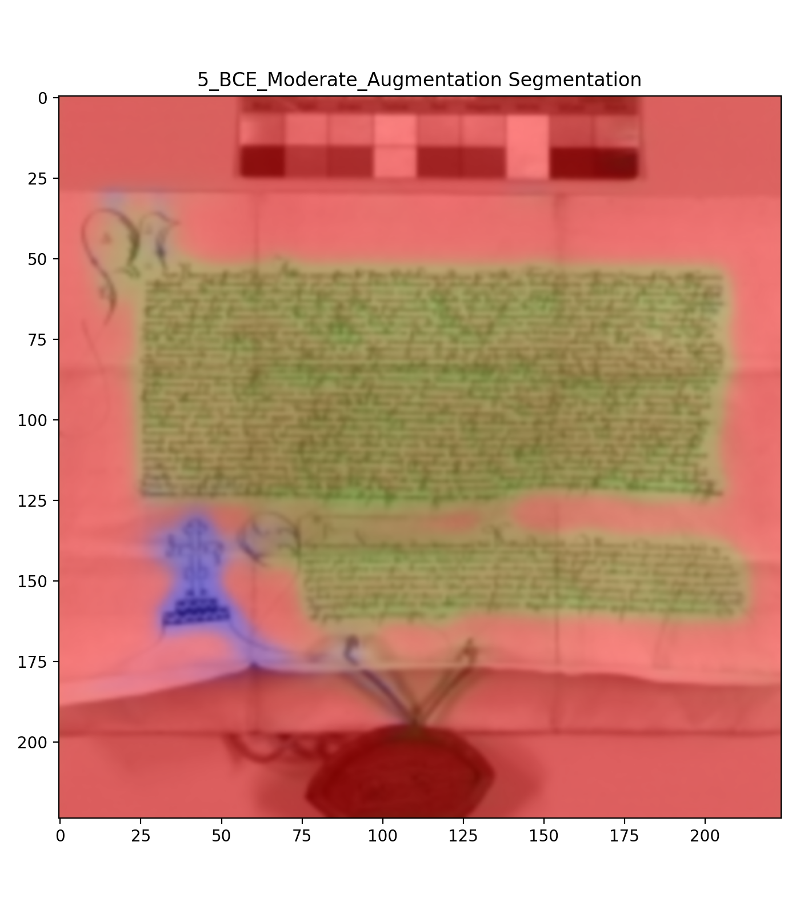
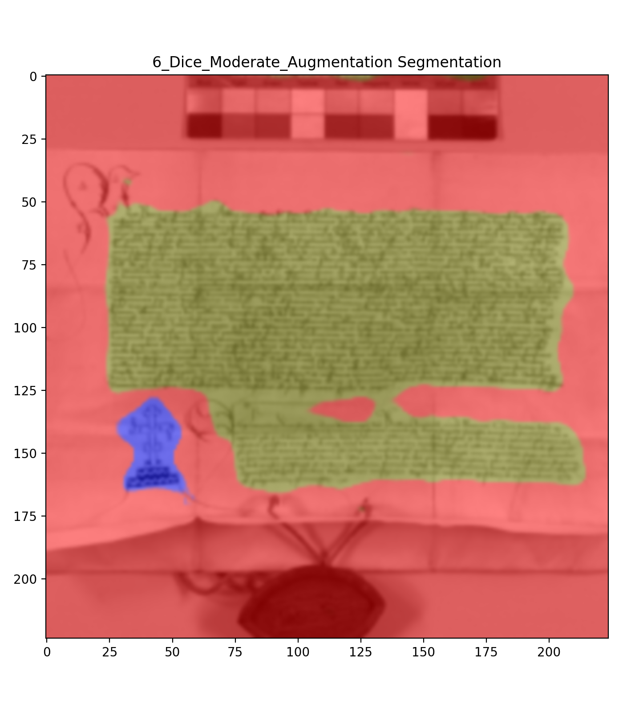
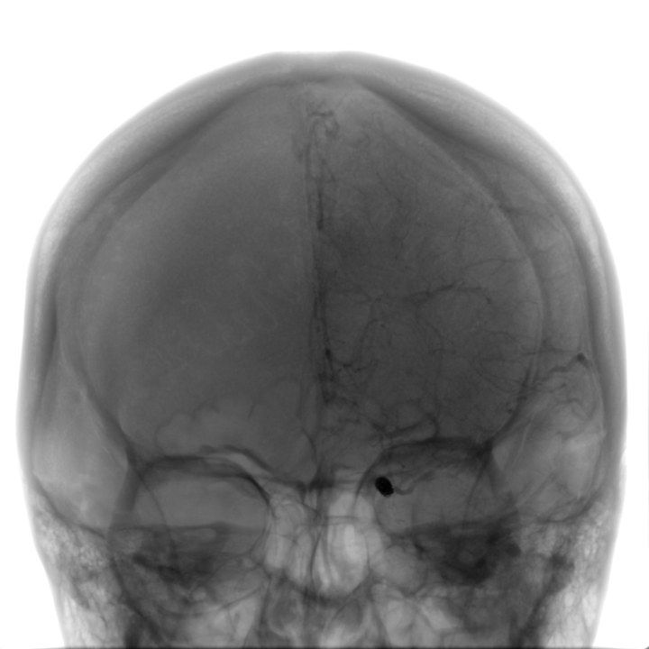
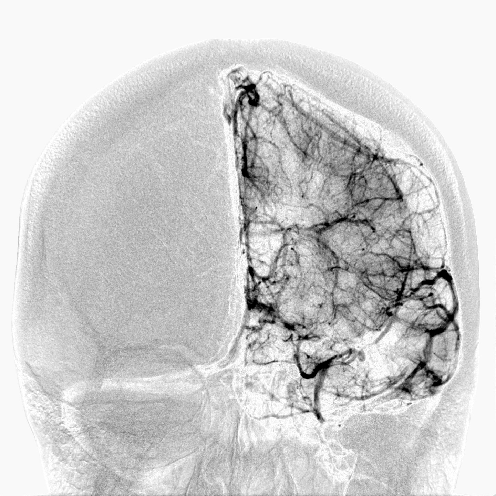
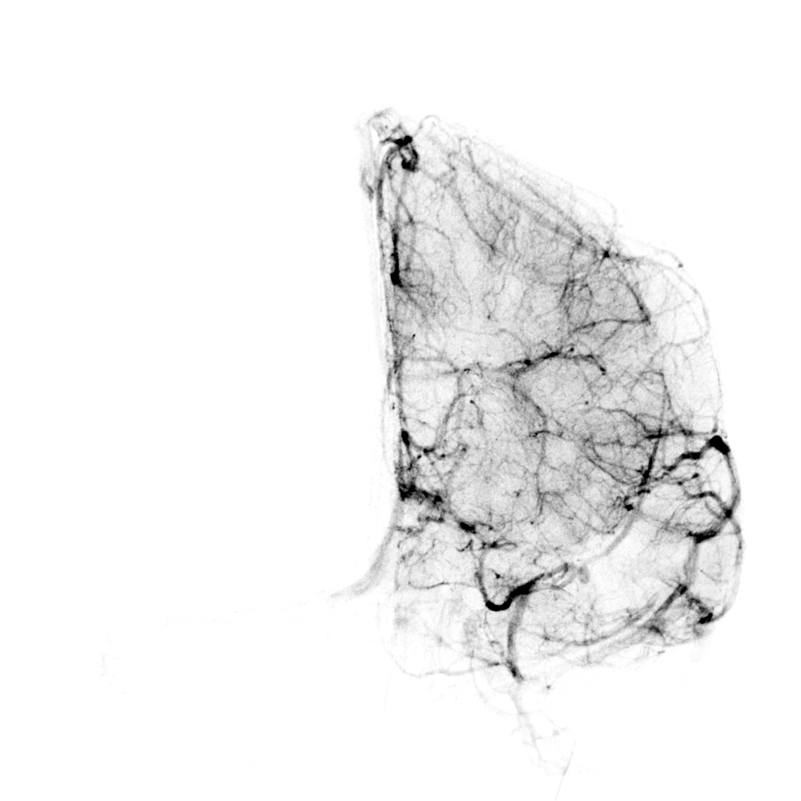

Hi,

Welcome to my research page. 
I am Martin Leipert,
a passionate Coder and Researcher in Industrial COmputed Tomography applications. Interested mainly in Medical Informatics, Image Processing and Deep Learning, I am looking for new opportunities. 
You will find more about me in my CV [here](curriculum), which you can download here as [PDF](files/curriculum.pdf).

# My Projects

Here I provide you three example projects of mine. They are selected from the areas of Augmented Reality, Image Processing and Deep Learning.

## Augmented Reality 

I developed a Unity visualization for a robotic simulation. The simulation uses untextured CAD Files of robotic systems, to simulate their kinematics. 
Based on the desktop project, I created a visualization for the Microsoft HoloLens. All calculations of the simulation are done on the desktop Backend. Communication with the HoloLens visualization is done via gRPC.

<iframe width="720" height="540" src="https://www.youtube.com/embed/9MjZfvcG7JE" frameborder="0" allow="accelerometer; autoplay; encrypted-media; gyroscope; picture-in-picture" allowfullscreen></iframe>

Additionally, I evaluated if real rooms could be integrated into the simulations collision model. As one can see below (from a very early stage plot) it likely works.

## Deep Learning

In my research intern at the Pattern Recognition Lab at FAU Erlangen-Nuremberg, I trained Neural Networks to retrieve medieval notary documents from a large document collection. In the collection only about 3.2 % of all documents are notary documents. Consequently, in training and retrieval class imbalance is quite severe. Additionally I trained a network (U-Net) to segment them. In both settings I used oversampling, different (dynamic) augmentations and loss functions (Cross Entropy, Negative Log Likelihood) to counter the class imbalance in segmentation and retrieval. For the dynamic augmentations I mainly used the Albumentations framework. 

### Best Settings for Classification

Network         | Augmentation    | Loss                        | Sensitivity   | Specifity | F-Value   | 
---------------:|:---------------:|:---------------------------:|:-------------:|:---------:|:---------:|
ResNet 50       | moderate 		  | Cross-Entropy               | 0.938         | 0.959     | 0.949     |
DenseNet 121    | moderate    	  | Cross-Entropy     			| 0.942         | 0.971     | 0.956     |

### Selected Segmentation Results

<table width="100%">
<tr>
    <th></th>
    <th></th>
    <th></th>
</tr>
<tr>
    <th align="center">Focal Loss</th>
    <th align="center">BCE Loss</th>
    <th align="center">Dice Loss</th>
  </tr>
</table>

In the segmentation plots, red is background, green is text and blue is the notary sign.
Although the result of Focal Loss seem bad at first glance, after applying the softmax they were equal / better than bce and dice loss.
 

## Image Registration

In my Bachelor's thesis I worked on a modification of an image registration algorithm. It is designed for real time 2D-2D-Registration in Digital Subtraction Angiography.
I implemented a coordinate transform within the algorithm and evaluated it's influence on computation time and stability of the optimisation. 
The images below are for illustration of the registration.

<table width="100%">
<tr>
    <th></th>
    <th></th>
    <th></th>
</tr>
<tr>
    <th align="center">Before DSA</th>
    <th align="center">Without Registration</th>
    <th align="center">With Registration</th>
  </tr>
</table>
